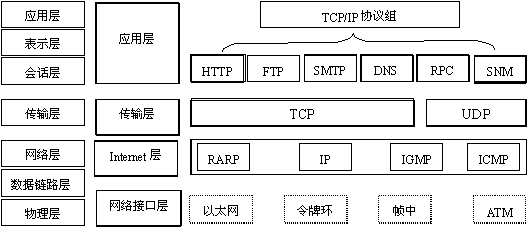

# Node中的网络编程

> Node的初衷就是建立一个高性能的Web服务器，这儿我们将着重于Node的网络编程。

*注：前面我们讲解了Node的许多模块，如http，fs，path...但也有好多模块现在没有进行讲解（我们将在遇到的时候进行讲解），因为这些模块在实际使用中并不是那么频繁，希望大家自己去官网查看文档，这对理解学习Node有相当大的帮助，同时也是必经之路。*

## 网络编程基本概念

**通过使用套接字来达到进程间通信目的的编程就是网络编程**
通常情况下，我们要使用网络提供的功能，可以有以下几种方式：

1. 使用应用软件提供的网络通信功能来获取网络服务，如浏览器，它在应用层上使用http协议，在传输层基于TCP协议；

2. 在命令行方式下使用shell 命令获取系统提供的网络服务，如telnet,ftp等；

3. 使用编程的方式通过系统调用获取操作系统提供给我们的网络服务。

对于网络编程的基础，大概要从**OSI的七层协议模型**开始了，除了OSI模型还有**TCP/IP 协议模型**





以FTP为例：

物理层到电缆连接，数据链路层到网卡，网络层路由到主机，传输层到端口，会话层维持会话，表示层表达数据格式，应用层就是具体FTP中的各种命令功能了。

在了解了这些之后，我们可以来看socket了。**socket是在应用层和传输层之间的一个抽象层，它把TCP/IP层复杂的操作抽象为几个简单的接口供应用层调用已实现进程在网络中通信。**也就是说socket（套接字）就是将操作系统中对于传输层及其以下各层中对于网络操作的处理进行了封装，然后提供一个socket对象，供我们在应用程序中调用这个对象及其方法来达到进程间通信的目的。

上面只是一个粗劣无比的介绍，推荐阅读一下文章：

- [简单理解Socket](http://www.cnblogs.com/dolphinX/p/3460545.html)
- [全栈必备：网络编程基础](http://blog.jobbole.com/110041/)

## Node 中的网络编程

Node.js也提供了对socket的支持，它提供了一个[net(网络)](http://nodejs.cn/api/net.html)模块用来处理和TCP相关的操作，提供了[dgram](http://nodejs.cn/api/dgram.html)模块用来处理UDP(数据报)相关操作

`net` 模块给你提供了一个异步的网络封装. 它包含创建服务器和客户端（称为流）的功能

1.创建TCP客户端

*net模块通过`net.createServer`方法创建TCP服务器*

```javascript
// server.js
const net = require('net')
// 创建TCP服务器
const server = net.createServer((socket) => {
    console.log('客户端连接')
    // 监听客户端的数据
    socket.on('data', (data) => {
        console.log('监听客户端的数据: ', data.toString())
    });
    // 监听客户端断开连接事件
    socket.on('end', (data) => {
        console.log('客户端断开连接')
    });
    // 发送数据给客户端
    socket.write('哈哈哈，我是一个测试 \r\n')
})
// 启动服务
server.listen(8080, () => {
    console.log('服务创建')
})
```

2.创建客户端

*通过`net.connect`方法创建客户端去连接服务器*

```javascript
// client.js
const net = require('net');
// 连接服务器
const client = net.connect({port: 8080}, () => {
    console.log('连接服务器');
    client.write('http://xingxin.me \r\n')
})
// 接收服务端的数据
client.on('data', (data) => {
    console.log('接收服务端的数据: ', data.toString())
    // 断开连接
    client.end()
})
// 断开连接
client.on('end', () => {
    console.log('断开连接')
})
```

现在我们在命令行中执行

```bash
$ node server.js

# 再开一个命令行执行
$ node client.js
```

你会看到如下结果

```bash
$ node client.js
连接服务器
接收服务端的数据:  哈哈哈，我是一个测试

断开连接

####################################

$ node server.js
server bound
客户端连接
监听客户端的数据:  http://xingxin.me

客户端断开连接
```

这儿我们介绍了使用Net模块创建Socket服务端与客户端，关于更多使用参见[Node中文网](http://nodejs.cn/api/net.html)

### 简易聊天室

前面我们介绍了网络编程以及Node中的实现，我们现在就成热打铁来写一个简易的聊天室

传送门[GitHub](/lesson7)

#### 1. 聊天室的服务端

```javascript
const net = require('net')
// 创建TCP服务器
const server = net.createServer()
// 存储所有客户端socket
let sockets = []
server.on('connection', function(socket) {
    console.log('Got a new connection')
    sockets.push(socket)
    socket.on('data', function(data) {
        console.log('Got data: ', data)
        sockets.forEach(function(otherSocket) {
            if (otherSocket !== socket) {
                otherSocket.write(data)
            }
        })
    })
    socket.on('close', function() {
        console.log('A client connection closed')
        let index = sockets.indexOf(socket)
        sockets.splice(index, 1)
    })
})
server.on('error', function(err) {
    console.log('Server error: ', err.message)
})
server.on('close', function() {
    console.log('Server closed')
})
server.listen(8080)
```

#### 2. 聊天室的客户端
```javascript
const net = require('net')
process.stdin.resume()
process.stdin.setEncoding('utf8');
const client = net.connect({ port: 8080 }, () => {
    console.log('Connected to server')
    // 获取输入的字符串
    console.log('input: ')
    process.stdin.on('data', (data) => {
        // 发送输入的字符串到服务器
        console.log('input: ')
        client.write(data)
        // 输入 'close' 字符串时关闭连接
        if (data === 'close\n') {
            client.end()
        }
    });
});
// 获取服务端发送过来的数据
client.on('data', (data) => {
    console.log('Other user\'s input', data.toString())
})
client.on('end', () => {
    console.log('Disconnected from server')
    // 退出客户端程序
    process.exit()
})
```

在命令行中`node server.js`创建一个服务器，然后用`node client.js`起多个客户端，便可以看见这个简陋的聊天小程序

## 相关阅读

- [互联网协议入门](http://www.ruanyifeng.com/blog/2012/05/internet_protocol_suite_part_i.html)
- [简单理解Socket](http://www.cnblogs.com/dolphinX/p/3460545.html)
- [全栈必备：网络编程基础](http://blog.jobbole.com/110041/)